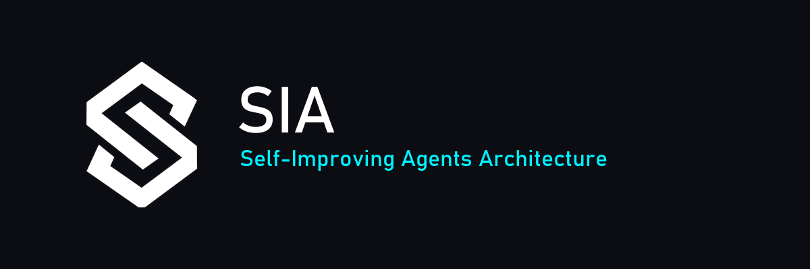

<p align="center">
  
</p>

<p align="center">
  
  
  
  
</p>

<p align="center">
  
</p>

<p align="center">
  <b>A portable, host-agnostic instruction package that turns a coding
  assistant into a self-improving project collaborator.</b>
</p>

It generates fresh, project-specific process artifacts (an `AGENT.md`, a
spec, a plan, subagent task briefs) instead of declaring "done"
prematurely, with human-in-the-loop approval gates and a self-healing
feedback loop.

This repo **is** the package. Clone it directly into a project as
`sia/` and you're set up.

## Install

```bash
git clone https://github.com/GunjanGrunge/SIA_package.git /path/to/your-project/sia
```

Then, in `your-project/`:

1. **Read [`sia/INSTALL.md`](./INSTALL.md)** — gitignoring this vendored
   folder correctly (while keeping the artifacts SIA *generates* for
   your project committed), and an optional Claude Code discovery shim.
2. **Tell your assistant once:** *"Read `sia/AGENT.md` and follow it."*
   That's the one mandatory entry point — from there it runs Intake,
   asks what it needs to, and generates your project's own `AGENT.md`,
   spec, and plan using the guides under `sia/guides/`.

No API keys, no account, no cloud dependency. It's plain markdown
instructions plus a small Python structure-test harness
(`tests/validate_sia.py`) used only when developing this package itself.

## What's in here

```
AGENT.md                          # bootstrap — read this first
guides/
├── questioning-and-approval.md   # batching questions, severity-tagged approval gates
├── writing-agent-md.md           # how to author a project's own AGENT.md
├── writing-spec.md               # how to author a project spec
├── writing-plan.md               # how to break a spec into a plan (file ownership, integration phase)
├── subagent-task-brief.md        # task brief / report / progress-log / integration-report formats
└── security-gate.md              # fixed threat-class checklist (software projects only)
capture-interface.md              # feedback capture + the self-healing loop-engineering mechanism
integrations/claude-code/SKILL.md # optional Claude Code auto-discovery shim
INSTALL.md                        # how to add this to a project (gitignore policy, discovery)
VALIDATION.md                     # the dogfood checklist this package is tested against
CHANGELOG.md
tests/                            # structure-test harness (dev tooling, not needed to use SIA)
```

## Core idea

SIA is a *generator*, not a library of pre-built templates. Every
project gets its own fresh `AGENT.md`, spec, and plan — never copied
from another project — authored using the guides here. The one
exception is `guides/security-gate.md`, a fixed, reused checklist for
software projects.

The feedback loop (`capture-interface.md`) turns verified mistakes into
project-specific standing rules with full provenance (source, evidence,
severity, error class, scope, date, active/retired status), re-checked
before every future proposal — so a project accumulates fewer repeated
mistakes over its life instead of a longer history of the same ones.

## Validation

`VALIDATION.md` is the dogfood checklist this package is tested against
before a version is called stable — real, previously-unseen codebases,
not synthetic examples. A pilot validation report covering several real
runs (including a full multi-subagent execution path: scoped task
briefs, independent implementer subagents, an independent reviewer, and
a real integration build) is maintained separately; ask the maintainer
for a link if you want to see it.

## License

MIT.
